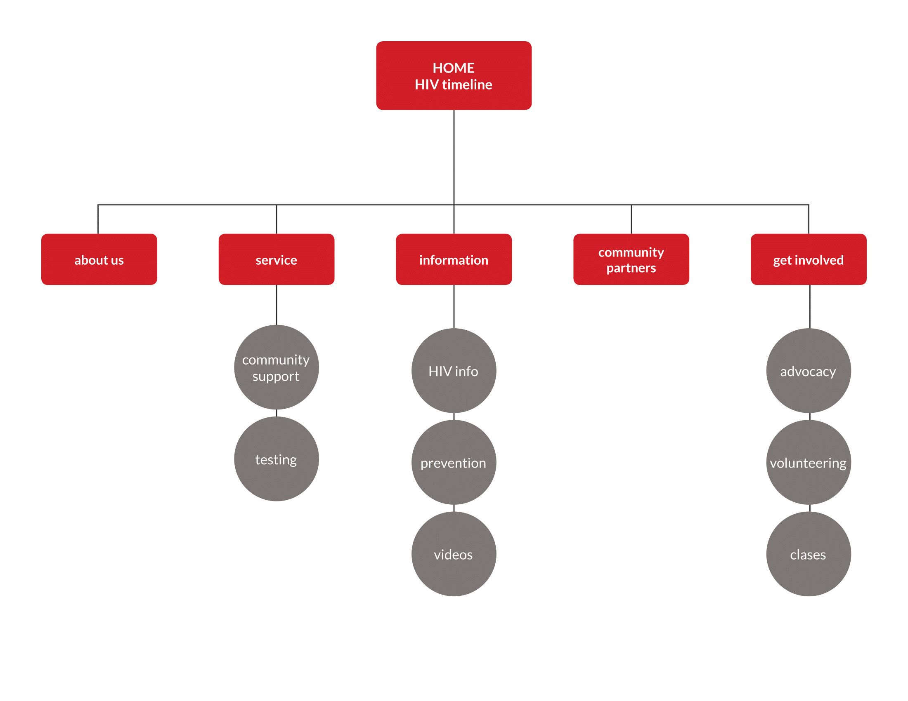
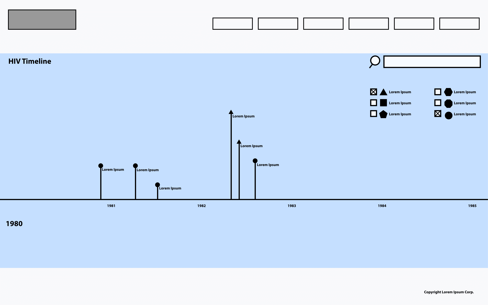
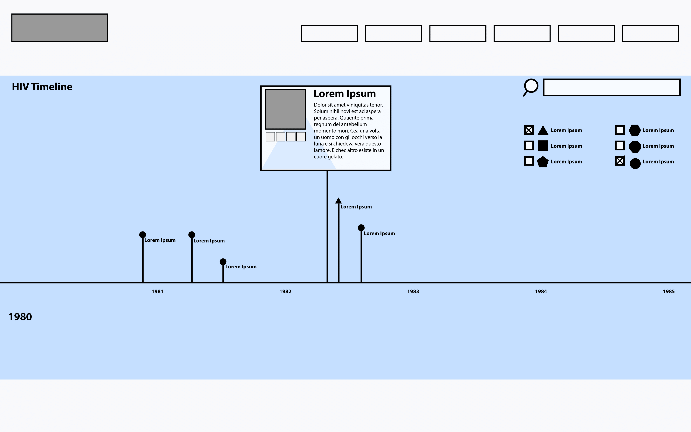
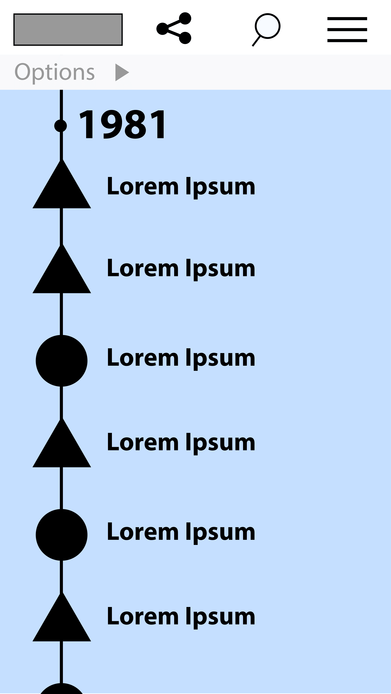
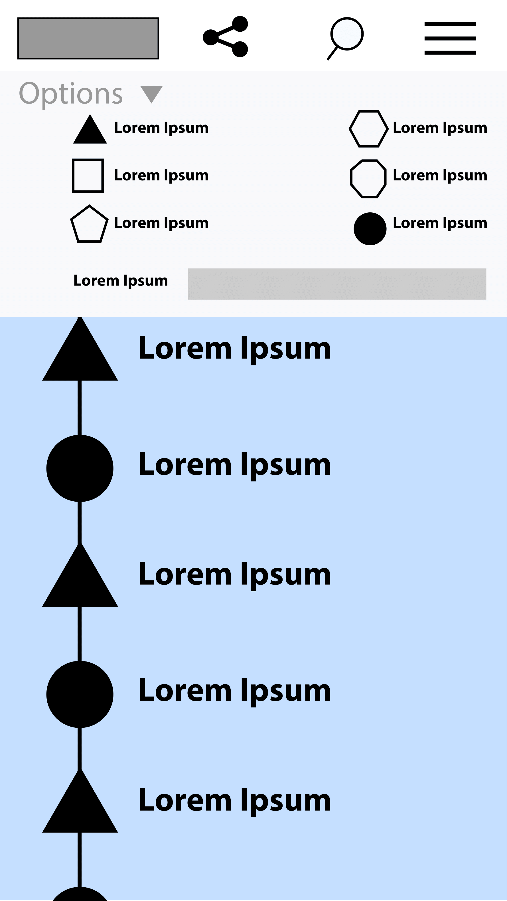
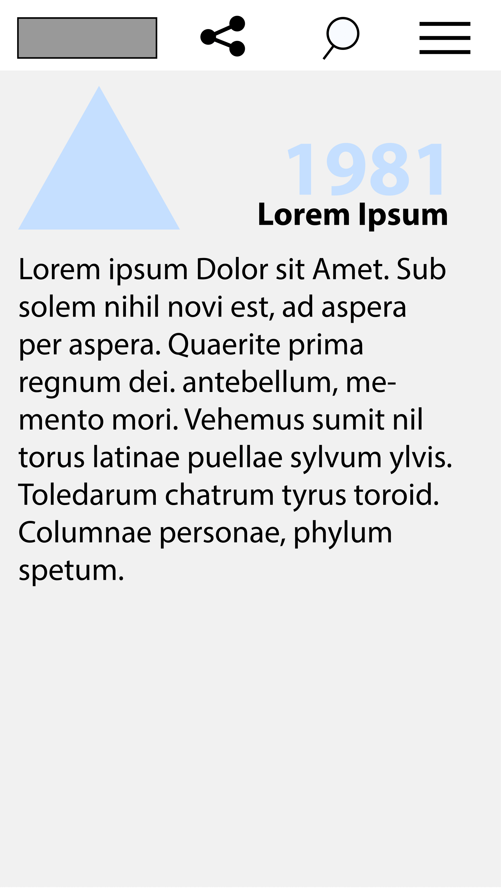

# HIV TIMELINE
## Functional Specification
#### Steven Wong, Leonardo H, Patrick Kelly, Allison Lu, Sandy Thomas

*>>> THIS SPEC IS NOT COMPLETE <<<*

### Table of Contents
* [Overview](#overview)
* [Scenarios](#Scenarios)
* [Goals](#goals)
* [Site Map](#site-map)
* [Screen by Screen Specification](#screen-by-screen-specification)
* [Feature requirements](#feature-requirements)

### Overview

The HIV Timeline website is inspired by the CCSF Health Education Department's yearly poster project. The project features posters hung in the Administration building hallway that detail five categories of HIV/AIDS history over the span of 1980 to the present. Each year is depicted as an individual poster that contains descriptions of historical events of that year in HIV/AIDS history.

The five categories for each year are:

* Public Health and Medicine
* International Information
* Political Happenings
* Social Activism
* Celebrities and Aids

The HIV Timeline website will take the existing historical information gathered over the past years of the project and translate that into an interactive timeline hosted on the CCSF server.

---

### Scenarios

###### Scenario 1: Mario

Mario is writing a research paper on HIV prevention and is seeking information with links to other legitimate resources. He takes a break from studying to see what's happening on Facebook on his iPhone, and notices an image shared by his friend that contains a factoid about when the first HIV vaccine was attempted. The post has a link to a website containing an HIV timeline. Mario clicks on the link that opens up his Safari browser on his phone and he is taken to where the fact is posted under the year the event happened. On the side he notices years listed in sequential order and clicks on those to browse other events that have been documented and reads some of the comments posted by other users. He'd like to find when World AIDS day was first declared so he performs a search. When he finds the fact he is looking for, he notices there is a Facebook icon next to it to share the factoid to his Facebook page. He clicks on the Resources page to find other websites that will support research for his paper.  

###### Scenario 2: Martha

Martha has recently reentered the dating scene and is looking for information on how to protect herself against HIV (the details of which she is largely unfamiliar with). In doing so, she has encountered the site and begins browsing. Martha finds a page easily with links to external resources about prevention, testing, and treatment. She also finds an embedded video on how-to have safer sex. There is also one relevant fact-sheet about HIV.

###### Scenario 3: Andrea

Andrea would very much like to be able to communicate and hangout with Jo (Her HIV positive friend.), but she would like to know more information about HIV so that she knows how to protect herself and Jo should also know the safe way to have the friendship while getting it cures. Andrea also thinks that hearing the positive messages from others who are HIV positive will support Jo emotionally. Andrea uses her mobile phone to search for information.

###### Scenario 4: John

John is attending CCSF and taking the Health 67 course and needs to study the current resources. He aims to find some information he can print out. The instructor of the course recommended the website as a starting point. He finds the resources section and prints out the brochure. While browsing the website, he finds a quiz and scores well. He decides to share his results with his social network.

###### Scenario 5: James

James is a Community Advisory Group Director of Bridge HIV. Bridge HIV is a global leader in HIV prevention, research, and education and works with local and international communities to discover effective prevention strategies through research, community partnerships, and educational initiatives. James' Community Advisory Group (CAG) is comprised of local individuals who consult with them to ensure that their work is responsive to the needs and concerns of the diverse communities served. James will be using the site to research local organizations that share similar goals and seek to team up with them on initiatives. He and his group aim to create close ties with the communities.

---

### What this project aims to do

#### Goals
1. Have a functioning timeline with content about past HIV events in history.
2. Be searchable.
3. Be low maintenance for site owner
4. Links to external resources, e.g., HIV testing and prevention sites
5. Link to internal resources, e.g., CCSF's Health 67 course: Systems of Prevention for HIV & Other Infectious Diseases
6. Links to outside groups/community partners
   1. SF Aids Foundation
   2. Bridge HIV
   3. API Wellness
   4. Instituto de Familiar de la Raza
   5. Department of Public Health
   6. Jewish Vocational Services
1. Include in-house created brochures in a digital format
   1. http://www.ccsf.edu/en/educational-programs/school-and-departments/school-of-health-and-physical-education/health-education-and-community-health-studies0/hiv-sti-prevention/HIVhivsti.html
1. Incorporate the visual assets that have been already made throughout the years (i.e., posters by the VMD students.)
   1. (check slack for full list of posters)
1. A current news section, or announcements.
2. Include a Getting Involved section
   1. promote Getting to Zero initiative: http://www.gettingtozerosf.org/
1. Add links or embed videos that Emily mentioned (fair use ALL the things)
   1. (check slack for full list of resources)
   2. Demystifying HIV Pre-Exposure Prophylaxis: https://www.youtube.com/watch?v=-Xx92whZS0o  
   3. Treatment Cascade: https://www.youtube.com/watch?v=DNaAlWWMG2k
   4. Act Up documentary

**Nice-to-haves**

* Quiz or game, shareable to social media
* A comment system of some sort
* Self-made video content

**Non-goals**

* Anything requiring high upkeep by site owner
* User registration

---

### Site Map

* Timeline
   * About Us
   * Services
      * Community Support
      * Testing & Treatment
   * Information
      * History
      * HIV Info
      * Videos
      * Prevention
   * Community Partners
   * Get Involved
      * Advocacy
      * Volunteering
      * Classes

#### Screen-by-screen specification
//  To be completed once we get templates from the VMD team

**Home Page/Timeline: (Desktop)**

**Subpage: (Desktop)**

**Home Page/Timeline: (Mobile)**

**Subpage: (Mobile)**

---

### Feature Requirements

**Search**
* Search always needs to be available
   * A search bar must be persistent and present at all times.
* Search needs to be able to access same database as timeline
* Search need to be able to communicate with timeline and move user to specific point in timeline
* Search needs to be able to judge relevance

**Videos**
* Embedded videos that are permissible
   * Truvada
   * Treatment cascade
   * act up documentary

**Quiz**
* Sharable

**Timeline Comments** (Still under debate)
* Considering the topic of this website, a comment system would need moderation.
